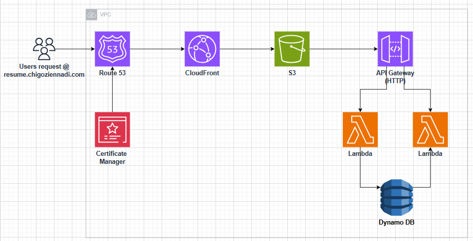

# AWS Cloud Resume Challenge (CI/CD & Terraform)

This project is a comprehensive, end-to-end deployment of a personal portfolio website built on AWS. The entire infrastructure is managed as code (IaC) using **Terraform**, and all deployments are fully automated with a **GitHub Actions** CI/CD pipeline.

**View the live project at: [https://resume.chigoziennadi.com](https://resume.chigoziennadi.com)**

---

## 🏗️ Architecture

This project consists of two main parts: a static frontend website and a serverless backend for a visitor counter. The entire infrastructure is 100% automated.

### Frontend (Website Delivery)

1.  **DNS:** A `CNAME` record in Namecheap points the `resume.chigoziennadi.com` domain to a CloudFront distribution.
2.  **CDN:** **AWS CloudFront** serves the website's static content globally and provides HTTPS security via an **AWS Certificate Manager (ACM)** SSL certificate.
3.  **Storage:** **AWS S3** hosts the static website files (HTML, CSS, JavaScript).

### Backend (Visitor Counter)

1.  **API:** The frontend's JavaScript calls a public **AWS API Gateway (HTTP API)** endpoint.
2.  **Compute:** The API Gateway triggers two separate **AWS Lambda** functions (one to read, one to increment).
3.  **Database:** The Lambda functions read and update a visitor count in an **AWS DynamoDB** table.

---

## ✨ Features

* **Fully Automated CI/CD:** Any `git push` to the `main` branch automatically triggers the GitHub Actions pipeline to build, test, and deploy the entire infrastructure and application.
* **100% Infrastructure as Code:** The entire cloud infrastructure (S3, CloudFront, Lambda, API Gateway, DynamoDB, IAM) is declaratively defined using **Terraform**.
* **Secure Terraform Backend:** Terraform's state is stored securely in an **S3 bucket** with versioning, and state locking is managed by **DynamoDB** to prevent concurrent pipeline failures.
* **Dynamic Configuration:** The pipeline dynamically generates a `config.js` file at build time, injecting the newly created API Gateway URL into the frontend code. This separates configuration from code.
* **Unique Visitor Counter:** The backend features two distinct serverless functions (`/get-views` and `/views`) and uses browser `localStorage` to ensure that only unique visitors increment the counter, not page refreshes.
* **Secure AWS Authentication:** The GitHub Actions pipeline uses **OIDC Connect** to securely authenticate with AWS via an IAM Role, eliminating the need for long-lived access keys.

---

## ⚙️ Tech Stack & Core Components

| Category | Technology | Purpose |
| :--- | :--- | :--- |
| **Frontend** | HTML, CSS, JavaScript | The static portfolio website. |
| **CI/CD** | **GitHub Actions** | Automates all testing, build, and deployment. |
| **IaC** | **Terraform** | Defines all cloud resources as code. |
| **Storage** | **AWS S3** | Hosts static files & stores Terraform state. |
| **CDN** | **AWS CloudFront** | Distributes the site globally with HTTPS. |
| **Certificate** | **AWS ACM** | Provides the free SSL/TLS certificate. |
| **API** | **AWS API Gateway** | Provides public HTTP endpoints for the backend. |
| **Compute** | **AWS Lambda** (Python) | Serverless functions for backend logic. |
| **Database** | **AWS DynamoDB** | NoSQL database for the visitor count & state locking. |
| **Security** | **AWS IAM** (OIDC) | Secure, keyless authentication for the pipeline. |

---

## 🚀 The CI/CD Pipeline

The `deploy.yml` workflow is the heart of this project. It runs the following steps on every push to `main`:

1.  **Checkout Code:** Clones the repository.
2.  **Configure AWS Credentials:** Securely assumes an IAM Role using OIDC.
3.  **Terraform Init:** Initializes Terraform, connecting to the S3 backend and DynamoDB lock table.
4.  **Terraform Validate:** Checks all `.tf` files for correct syntax.
5.  **Terraform Apply:** Deploys all infrastructure changes to AWS.
6.  **Generate config.js:** Gets the new API URL from Terraform's output and writes it to `src/config.js`.
7.  **Upload to S3:** Syncs the entire `src/` folder (including the new `config.js`) to the S3 bucket.
8.  **Seed DynamoDB:** Automatically adds the initial counter item (`page_id: "resume"`) to the database, making the pipeline 100% automated.

---
